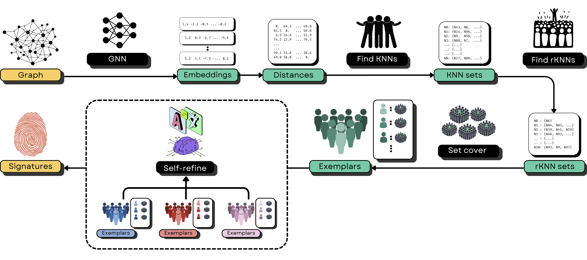

# GnnXemplar: Exemplars to Explanations - Natural Language Rules for Global GNN Interpretability


# Environment
```bash
conda clean -a
pip cache purge
conda create -n gnnxemplar python=3.10
conda activate gnnxemplar

# torch, torch_geometric
# We've used a cpu-only version. Feel free to use a gpu-version if you like.
conda install pytorch==1.13.1 torchvision==0.14.1 torchaudio==0.13.1 cpuonly -c pytorch
conda install pyg=2.5.2 -c pyg

# general purpose
conda install scikit-learn=1.4.2 networkx=3.1

# ogb
pip install ogb==1.3.6

# gemini
pip install google-generativeai==0.8.3
```

# Prompts and Models
Prompts and trained models can be found in `data/` folder which has the following directory structure:
```txt
data/
├── amazonratings
│   ├── dataset_config.json
│   └── model.pt
├── arxiv
│   ├── dataset_config.json
│   └── model.pt
├── bashapes
│   ├── dataset_config.json
│   └── model.pt
├── Citeseer
│   ├── dataset_config.json
│   └── model.pt
├── minesweeper
│   ├── dataset_config.json
│   └── model.pt
├── questions
│   ├── dataset_config.json
│   └── model.pt
├── TAGCora
│   ├── categories.csv
│   ├── cora.pt
│   ├── dataset_config.json
│   └── state_dict.pt
└── WikiCS
    ├── dataset_config.json
    └── state_dict.pt
```

# Running the code
- Update your gemini API Key in `src/llm_self_refine.py`
- Run all commands from the repo's home directory.

```bash
# This finds the exemplars for each class and store them in the data/ directory.
python src/find_exemplars.py -h
python src/find_exemplars.py ...

# This finds the global explanations and stores them in the data/ directory.
python src/llm_self_refine.py -h
python src/llm_self_refine.py ...
```

Example run on TAGCora with the default parameters
```bash
python src/find_exemplars.py -d TAGCora 
python src/llm_self_refine.py -d TAGCora
```

# Output explanations
After running the pipeline on a dataset, you'll find:
- Signatures in `data/<dataset>/cluster_summaries.txt`
- Human-readable global explanations in `data/<dataset>/combined_explanations.txt`
- Metrics in `data/<dataset>/metrics.txt`
